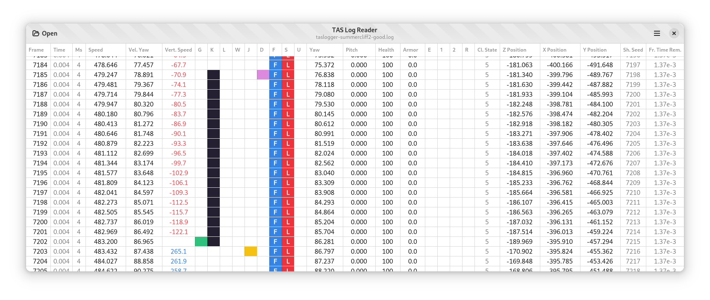
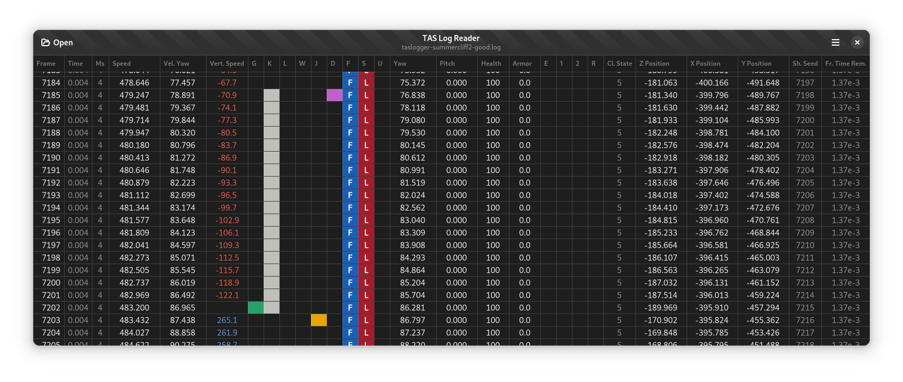

# TAS Log Reader

Proof-of-concept GTK 4 version of [qconread2]. Servers as a decent test case for diagnosing the [scrolling performance](https://gitlab.gnome.org/GNOME/gtk/-/issues/3334) and perhaps for data table style updates too.

[qconread2]: https://github.com/HLTAS/qconread2